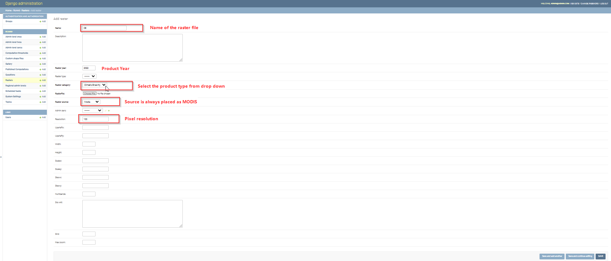

.. figure:: ../_static/Images/wind.png

***************************************************
Updating Climate Erosivity Regional Output
***************************************************
Climate Erosivity output, after computation, is reclassified into 5 descrete classes, and later uploaded through the django admin.
The classification applied can be accessed through QGIS on raster classificaytion and symbolization functionalities.
Once the raster is ready, the manager then updates the datasets, with proper tagging by giving proper names, years and data pixel resolution resolution.
The process is illustrated below.

After the raster has been added succefuly, please click save button and clear cache in order for the updates to reflect on the user interface.

.. figure:: ../_static/Images/wind.png

.. toctree::
   :maxdepth: 3
