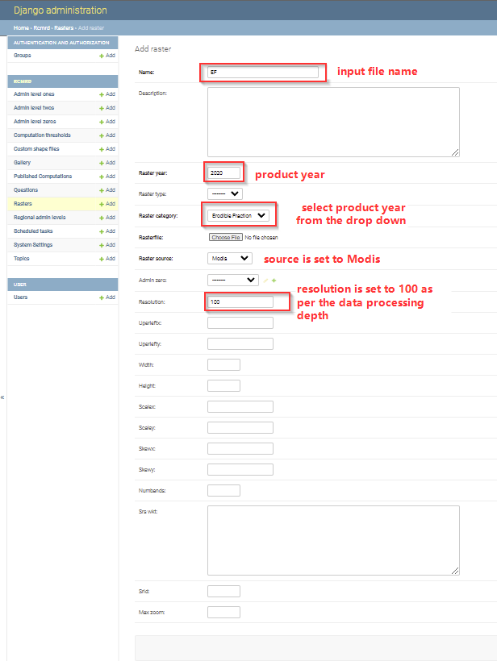

.. figure:: ../_static/Images/wind.png

***************************************************
Updating Erodible Fraction Factor
***************************************************
After computing the Erodible Fraction factor, the EF output is reclassified into 5 descrete classes, and later uploaded through the django admin.
The classification applied can be accessed through QGIS on raster classification and symbolization functionalities.
Once the raster is ready, the manager then updates the datasets, with proper tagging by giving proper names, years and data pixel resolution.
The process is illustrated below.

After the raster has been added successfully,the manager should click the save button, clear cache in order for the updates to reflect on the user interface.

.. figure:: ../_static/Images/wind.png
.. toctree::
   :maxdepth: 3
