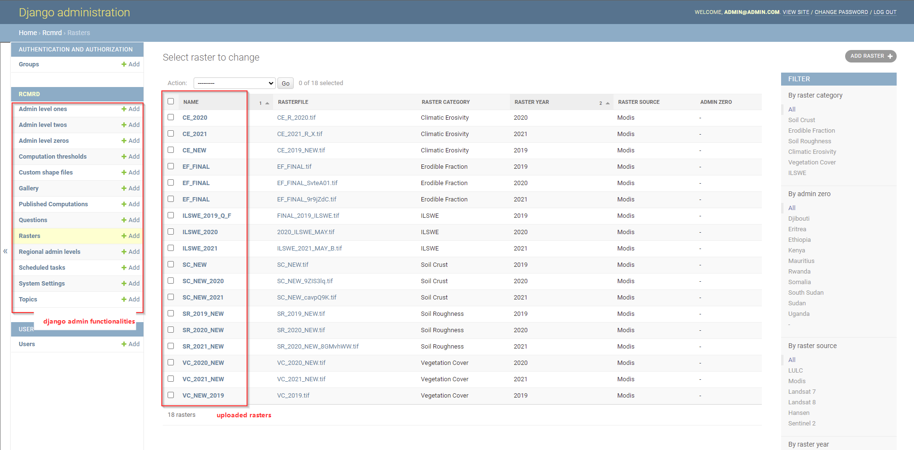
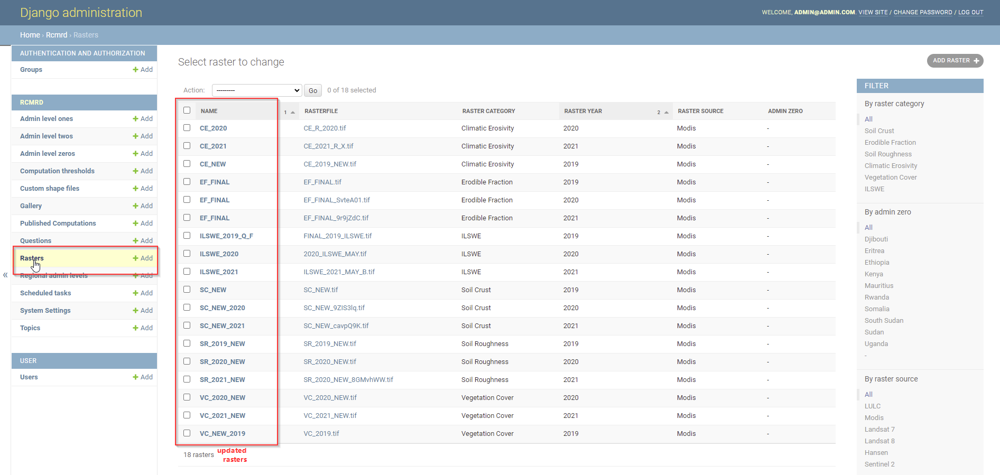

***************************************************
Django Admin Site Administration Guide
***************************************************
LaSWE backend system is developed on django admin. This framework is capable of intergrating python fnctions on data and generate APIs for 
sharing of data as well as processing of the same data. Some common processes on raster data include clipping, merging, classification using a 
styling layer descriptor among other raster processes.
In order to update the datasets for the LaSWE system after preparations, the system admin will require frequent access to the django administration panel.
After accessing the panel, the system manager should update the data on the platform for the user to access on the user interface section.

The system admin will require to use these IP address and a password for LaSWE system.

* Url : http://185.215.167.246:1337/admin/
* Username: admin@admin.com
* Password: winderosion#5].

The figure below shows the django admin home page, when the IT admin logs in. To log in to the Django admin framewok, please use the 
authorised LaSWE email created as a super user as provided above. The IT admin will also be able to give roles to various system users as will be demonstrated.

  
The main duties that will be performed by system admins is the updating of the regional rasters as discussed in the next section for each of the factors including:

* Climate Erosivity
* Erodible Fraction factor
* Soil crust factor
* Vegetation sensitivity
* SUrface Roughness
* Index of Land Susceptibility to Wind Erosion (ILSWE)

To update rasters in the django admin, the system manager should update through the raster functionality shown in the django function list as illustrated below.

The rest of the functionalities are not applied in managing LaSWE system, except for the gallery section. Used to upload new sets of images in the system, for users interaction and visualisation.

  

    

.. toctree::
   :maxdepth: 3
