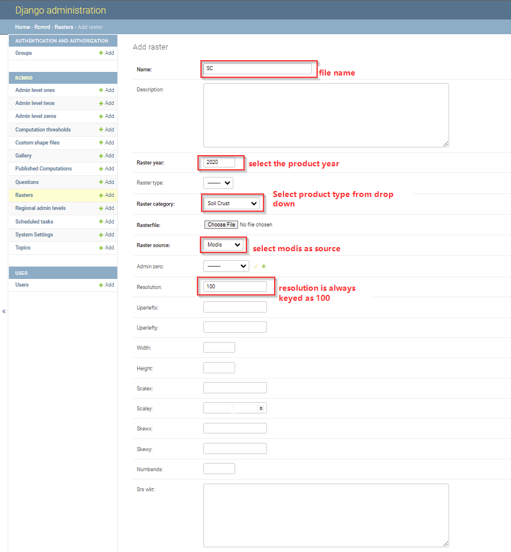

.. figure:: ../_static/Images/wind.png

***************************************************
Updating Soil Crust (SC) Factor
***************************************************
After computing the Soil Crust factor, SC output is reclassified into 5 descrete classes, and later uploaded through the django admin. The classification applied can be accessed through QGIS on raster classification and symbolization functionalities. Once the raster is ready, the system manager updates the datasets, with proper tagging by giving proper names, years and data pixel resolution. The process is illustrated below.

.. figure:: ../_static/Images/wind.png

.. toctree::
   :maxdepth: 3
