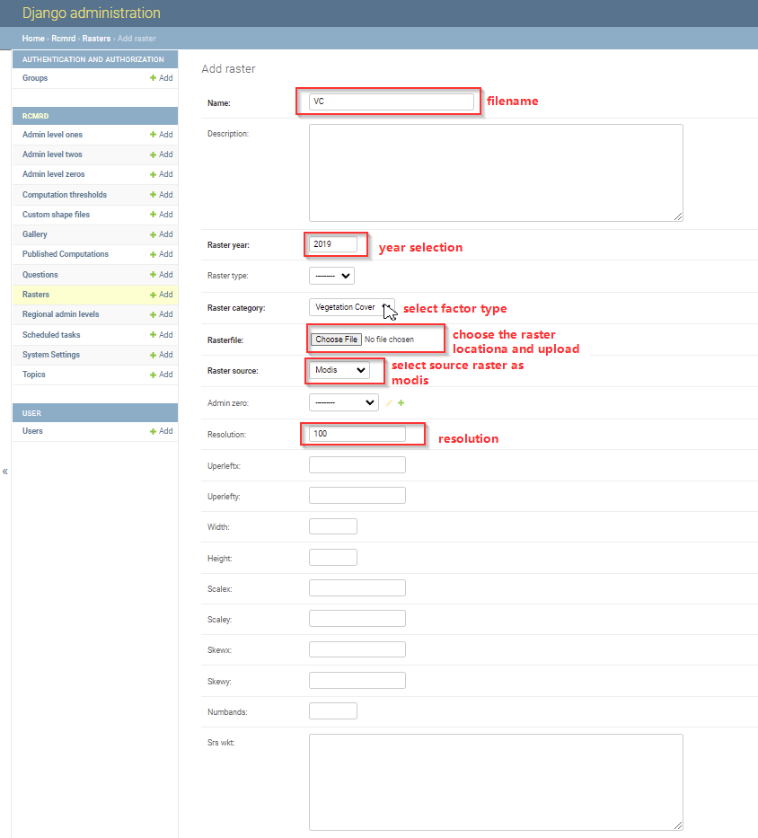

.. figure:: ../_static/Images/wind.png

***************************************************
Updating Vegetation Cover Sensitivity (VC) Factor
***************************************************
After computing the vegetation cover sensitivity, VC output is reclassified into 5 descrete classes, and later uploaded through the django admin. The classification applied can be accessed through QGIS on raster classification and symbolization functionalities. Once the raster is ready, the system manager updates the datasets, with proper tagging by giving proper names, years and data pixel resolution. The process is illustrated below.

After adding the raster successfully,the system manager should click the save button, clear cache in order for the updates to reflect on the user interface. The resolution should always be a maximum of 100 meterS, this is considered as the minimum processing resolution during factor computation.

.. figure:: ../_static/Images/wind.png

.. toctree::
   :maxdepth: 3

